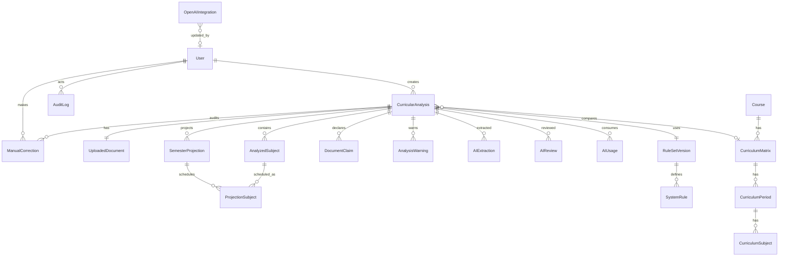

# DATABASE.md — Modelo de dados (PostgreSQL 17 + Prisma 7)

## 1. Convenções

- Chaves primárias `uuid` (`gen_random_uuid()`), `createdAt`/`updatedAt` em `timestamptz`.
- Enums nativos do PostgreSQL via Prisma.
- Campos JSONB para estruturas versionadas (saída bruta da IA, posições do parser, passos de processamento).
- Nunca armazenar: API Key em texto puro, CPF/RG extraídos, chain-of-thought.
- Tabelas de histórico (`ManualCorrection`, `AuditLog`, `AIUsage`) são **append-only** no fluxo normal. A única exceção é a área **Configurações → Manutenção de dados** (ADMIN, confirmação por texto), que permite limpar auditoria, uso de IA e análises — a limpeza em si gera um registro de auditoria com o resumo.

## 2. Enums

| Enum | Valores |
|------|---------|
| `Role` | ADMIN, ANALYST, VIEWER |
| `AnalysisStatus` | UPLOADED, PARSING, AI_EXTRACTION, NORMALIZING, CALCULATING, VALIDATING, AI_AUDIT, WAITING_REVIEW, COMPLETED, FAILED, AI_ERROR |
| `SubjectStatus` | EXEMPTED (Dispensada), PENDING (Pendente), REVIEW (Revisar) |
| `Readability` | CLEAR, UNCLEAR, UNREADABLE |
| `SubjectOrigin` | AI, USER |
| `EntryPeriodSource` | DOCUMENT, STRUCTURED, RULE, USER |
| `ReliabilityLevel` | HIGH, REVIEW_RECOMMENDED, REVIEW_REQUIRED |
| `ProjectionSubjectKind` | REGULAR, BACKLOG |
| `WarningSeverity` | INFO, WARNING, CRITICAL |
| `AIOperation` | DOCUMENT_EXTRACTION, CURRICULUM_EXTRACTION, AUDIT, FINAL_EXPLANATION, CONNECTION_TEST |
| `AIReviewStatus` | OK, REVIEW |
| `IntegrationStatus` | DISCONNECTED, CONNECTED, ERROR |
| `RuleStatus` | CONFIRMED, CONFIGURABLE, NOT_CONFIGURED |
| `RetentionPolicy` | DAYS_30, DAYS_90, DAYS_180, INDEFINITE, DELETE_AFTER_PROCESSING |
| `AIPrivacyMode` | PDF_FILE, REDACTED_TEXT |

## 3. Entidades

### Identidade e acesso
- **User**: `email` (único, citext-like via lowercase), `passwordHash` (argon2id), `name`, `role`, `isActive`, `lastLoginAt`.
- **AuditLog**: `userId?`, `action`, `entityType`, `entityId?`, `metadata` JSONB (redigido), `ip`, `userAgent`, `createdAt`.

### Análise
- **CurricularAnalysis**: `status`, `createdById`, `courseName?`, `matrixLabel?`, `entryPeriod?`, `entryPeriodSource?`,
  `startTerm` (`YYYY.S`), `reliability?`, `reviewItemsCount`, `processingSteps` JSONB, `errorCode?`, `errorMessage?`,
  `ruleSetVersionId`, `engineVersion`, `extractorPromptVersion?`, `auditorPromptVersion?`, `extractionModel?`,
  `auditModel?`, `curriculumMatrixId?`, `completedAt?`, `lastCalculatedAt?`.
- **UploadedDocument** (1:1 com análise): `originalName`, `storageKey`, `sizeBytes`, `sha256`, `pageCount`, `mimeType`,
  `localExtraction` JSONB (`{pages:[{page, width, height, lines:[{y, x, w, h, text}]}]}`), `deleteAfter?`, `deletedAt?`.
- **AnalyzedSubject**: `rowHash` (único por análise), `name`, `workload`, `period`, `usedSubject?`, `status`, `readability`,
  `sourcePage`, `sourceRow`, `bbox` JSONB?, `origin`, `sortIndex`.
- **SemesterProjection**: `index`, `term`, `periodNumber?`, `isAdditional`, `subjectsInPeriod`, `exemptedInPeriod`,
  `regularSubjectsToTake`, `maximumCapacity`, `backlogCapacity`, `subjectsFromBacklog`, `semesterLoad`, `remainingBacklog`.
- **ProjectionSubject**: `projectionId`, `subjectId`, `kind`. Único `(projectionId, subjectId)` e único `(analysis, subjectId)`
  garantido pelo validador (nenhuma disciplina programada duas vezes).
- **DocumentClaim**: `type`, `value?`, `sourcePage`, `rawText?`, `calculatedValue?`, `matches?`.
- **AnalysisWarning**: `code`, `severity`, `message`, `subjectId?`, `sourcePage?`, `source` (VALIDATOR | AUDITOR | MATRIX | PIPELINE), `resolvedAt?`, `resolvedById?`.
- **ManualCorrection** (append-only): `subjectId?`, `userId`, `field`, `previousValue`, `newValue`, `reason?`.

### IA
- **AIExtraction**: `model`, `promptVersion`, `privacyMode`, `rawOutput` JSONB, `durationMs`, `status`, `errorCode?`.
- **AIReview**: `model`, `promptVersion`, `status`, `issues` JSONB, `durationMs`.
- **AIUsage** (append-only): `analysisId?`, `operation`, `model`, `inputTokens`, `outputTokens`, `totalTokens`, `estimatedCost` (decimal 12,6), `createdAt`.
- **OpenAIIntegration** (linha única, `id = 'default'`): `status`, `encryptedApiKey?`, `encryptionIv?`, `encryptionAuthTag?`,
  `keyVersion?`, `apiKeyLastFour?`, `extractionModel`, `auditModel`, `futureExplanationModel?`, `projectLabel?`,
  `serviceAccountLabel?`, `lastTestedAt?`, `lastConnectionStatus?`, `lastErrorCode?`, `createdById?`, `updatedById?`.

### Regras e matrizes
- **RuleSetVersion**: `version` (único), `isActive`, `effectiveFrom`, `notes?`, `createdById?`.
- **SystemRule**: `ruleSetVersionId`, `key` (único por versão), `valueType`, `value` JSONB, `status`, `description`.
- **Course**: `name`, `code?`, `modality?`.
- **CurriculumMatrix**: `courseId`, `label`, `year`, `version`, `validFrom?`, `validTo?`, `isActive`.
- **CurriculumPeriod**: `matrixId`, `number`, `label?`.
- **CurriculumSubject**: `periodId`, `name`, `workload`, `prerequisites` JSONB (lista de nomes; informativa).
- **SystemSetting**: `key` (único), `value` JSONB — `retentionPolicy`, `aiPrivacyMode`, `institutionName`, `defaultStartTerm`.

## 4. ERD

## 5. Índices relevantes

- `CurricularAnalysis(status, createdAt desc)`, `(createdById)`.
- `AnalyzedSubject(analysisId, period, sortIndex)`, único `(analysisId, rowHash)`.
- `ProjectionSubject` único `(projectionId, subjectId)`.
- `AIUsage(createdAt)`, `(analysisId)`.
- `AuditLog(createdAt desc)`, `(entityType, entityId)`.
- `UploadedDocument(deleteAfter)` para a rotina de retenção.

## 6. Retenção

`SystemSetting.retentionPolicy` define `UploadedDocument.deleteAfter` na criação. A rotina de retenção remove o arquivo
físico e marca `deletedAt`; os dados estruturados da análise permanecem. `DELETE_AFTER_PROCESSING` apaga ao concluir.
